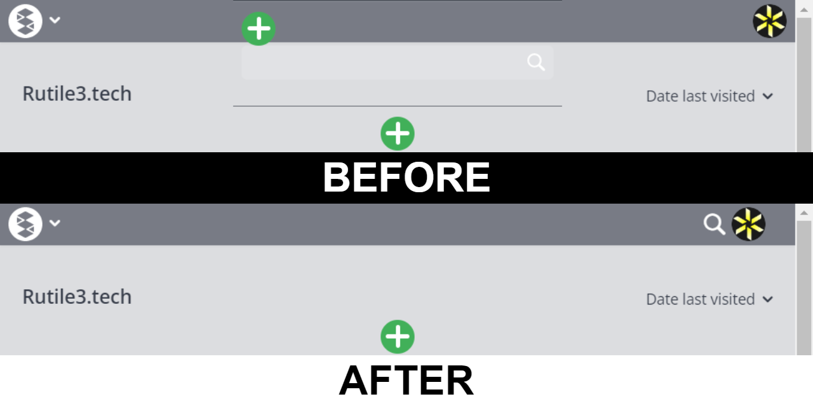
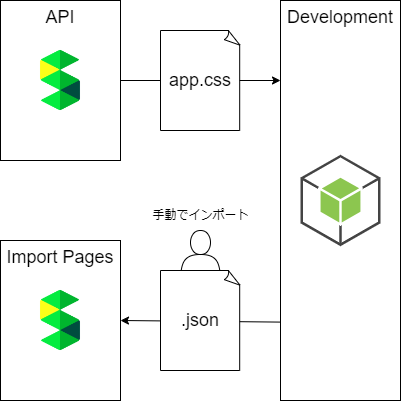

# README.md

## 目次

- [README.md](#readmemd)
  - [目次](#目次)
  - [開発構成の概要](#開発構成の概要)
  - [使用技術](#使用技術)
  - [環境構築の手順](#環境構築の手順)
    - [Node.jsの環境を構築](#nodejsの環境を構築)
    - [VSCodeの環境を構築](#vscodeの環境を構築)
    - [パッケージをインストール](#パッケージをインストール)
    - [デバッグを実行](#デバッグを実行)
  - [ディレクトリ構成](#ディレクトリ構成)
  - [コーディングルールについて](#コーディングルールについて)
  - [プロジェクトを進める上での参考記事](#プロジェクトを進める上での参考記事)

--------------------------------------------------

## 開発構成の概要

APIからapp.cssを取得し、メディアクエリのブレークポイントを修正したCSSをJSONで出力します。
出力したJSONをScrapboxに手動でインポートします。  

--------------------------------------------------

## 使用技術

- node v18.16.0
- npm v9.5.1
- [css](https://www.npmjs.com/package/css) v3.0.0,
- [prettier](https://www.npmjs.com/package/prettier) v2.8.7
- [typescript](https://www.npmjs.com/package/typescript) v5.0.4

--------------------------------------------------

## 環境構築の手順

### Node.jsの環境を構築

### VSCodeの環境を構築

- [Prettier - Code formatter](https://marketplace.visualstudio.com/items?itemName=esbenp.prettier-vscode)

### パッケージをインストール

ターミナルで`npm install`と実行すると、package.jsonに記述している依存パッケージをnode_modulesフォルダに自動でインストールできます。

### デバッグを実行

--------------------------------------------------

## ディレクトリ構成

> scrapbox-breakpoint-fixer-generator/  
> ├─.vscode/  
> │  ├─launch.json # 実行用の設定  
> │  └─tasks.json # ビルド(コンパイル)用の設定  
> ├─doc/  
> │  └─コーディング規約_TypeScript.md  
> ├─node_modules/ # 依存パッケージ  
> ├─out/ # コンパイル後の実行ファイルと map ファイル  
> ├─src/  
> │  ├─consoleLog.ts # ログ出力のラッパー  
> │  ├─downloadAppCss.ts # Scrapbox から app.css をダウンロード  
> │  ├─importJsonIntoScrapbox.ts # Scrapbox にインポートする JSON  
> │  └─index.ts # ビルドのエントリーポイント（メイン処理）  
> ├─.gitignore  
> ├─package-lock.json  
> ├─package.json  
> ├─README.md # この文書  
> ├─scrapbox-breakpoint-fixer-generator.code-workspace # VSCode のワークスペース  
> └─tsconfig.json # TypeScriptの設定  

--------------------------------------------------

## コーディングルールについて

[コーディングルール_TypeScript.md](doc/コーディングルール_TypeScript.md)を参照してください。

--------------------------------------------------

## プロジェクトを進める上での参考記事

- [VSCodeでよく作るTypeScriptの学習環境](https://blog.mamansoft.net/2020/10/14/vscode-typescript-learning/)
- [特定のウィンドウサイズで検索欄の見た目が崩れる](https://scrapbox.io/forum-jp/特定のウィンドウサイズで検索欄の見た目が崩れる)
- [scrapbox-breakpoint-fixer](https://scrapbox.io/Rutile3Tech/scrapbox-breakpoint-fixer)
