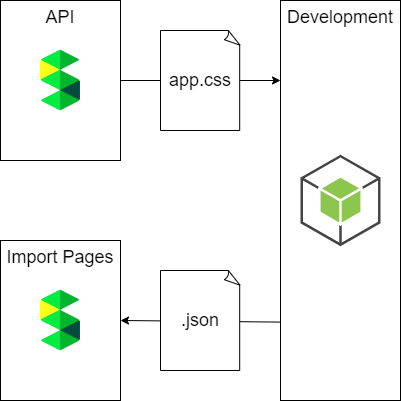

# README.md

## 目次

- [README.md](#readmemd)
  - [目次](#目次)
  - [コーディングルールについて](#コーディングルールについて)
  - [開発構成の概要](#開発構成の概要)
  - [使用技術](#使用技術)
  - [環境構築の手順](#環境構築の手順)
    - [Node.jsの環境を構築](#nodejsの環境を構築)
    - [VSCodeの環境を構築](#vscodeの環境を構築)
    - [パッケージをインストール](#パッケージをインストール)
    - [デバッグを実行](#デバッグを実行)
  - [プロジェクトを進める上での参考記事](#プロジェクトを進める上での参考記事)

---

## コーディングルールについて

[コーディング規約_TypeScript.md](コーディング規約_TypeScript.md)を参照してください。

---

## 開発構成の概要

apiからapp.cssを取得し、メディアクエリのブレークポイントを修正したCSSをJSONで出力します。  

---

## 使用技術

- node v18.16.0
- npm v9.5.1
- [css](https://www.npmjs.com/package/css) v3.0.0,
- [prettier](https://www.npmjs.com/package/prettier) v2.8.7
- [typescript](https://www.npmjs.com/package/typescript) v5.0.4

---

## 環境構築の手順

### Node.jsの環境を構築

### VSCodeの環境を構築

### パッケージをインストール

### デバッグを実行

---

## プロジェクトを進める上での参考記事

- [VSCodeでよく作るTypeScriptの学習環境](https://blog.mamansoft.net/2020/10/14/vscode-typescript-learning/)
- [特定のウィンドウサイズで検索欄の見た目が崩れる](https://scrapbox.io/forum-jp/特定のウィンドウサイズで検索欄の見た目が崩れる)
- [app-breakpoint-fixer](https://scrapbox.io/Rutile3Tech/app-breakpoint-fixer)
